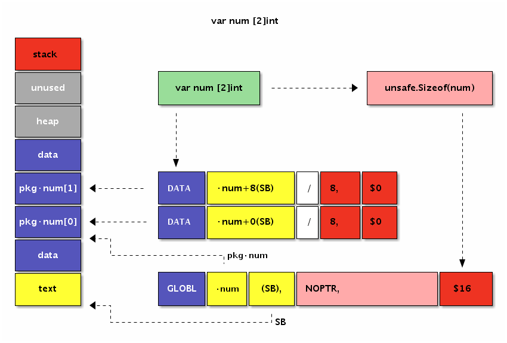

##### 语法基础

Go汇编语言提供了DATA命令用于初始化包变量，DATA命令的语法如下：

```
DATA symbol+offset(SB)/width, value
```
> symbol为变量在汇编语言中对应的标识符，offset是符号开始地址的偏移量，width是要初始化内存的宽度大小，value是要初始化的值。
> 其中当前包中Go语言定义的符号symbol，在汇编代码中对应·symbol，其中“·”中点符号为一个特殊的unicode符号 。

##### 特殊字符
为了简化Go汇编器的词法扫描程序的实现，特别引入了Unicode中的中点·和大写的除法/，对应的Unicode码点为U+00B7和U+2215.汇编器编译后，中点·会被替换为ASCII中的点“.”，大写的除法会被替换为ASCII码中的除法“/”，比如math/rand·Int会被替换为math/rand.Int 。

##### X86-64体系结构


> 在通用寄存器中BP和SP是两个比较特殊的寄存器：其中BP用于记录当前函数帧的开始位置，和函数调用相关的指令会隐式地影响BP的值；SP则对应当前栈指针的位置，和栈相关的指令会隐式地影响SP的值；而某些调试工具需要BP寄存器才能正常工作。

Go汇编为了简化汇编代码的编写，引入了PC、FP、SP、SB四个伪寄存器。四个伪寄存器加其它的通用寄存器就是Go汇编语言对CPU的重新抽象，该抽象的结构也适用于其它非X86类型的体系结构。

四个伪寄存器和X86/AMD64的内存和寄存器的相互关系如下图：


> 在AMD64环境，伪PC寄存器其实是IP指令计数器寄存器的别名。伪FP寄存器对应的是函数的帧指针，一般用来访问函数的参数和返回值。伪SP栈指针对应的是当前函数栈帧的底部（不包括参数和返回值部分），一般用于定位局部变量。伪SP是一个比较特殊的寄存器，因为还存在一个同名的SP真寄存器。真SP寄存器对应的是栈的顶部，一般用于定位调用其它函数的参数和返回值。
>
> 当需要区分伪寄存器和真寄存器的时候只需要记住一点：伪寄存器一般需要一个标识符和偏移量为前缀，如果没有标识符前缀则是真寄存器。比如`(SP)`、`+8(SP)`没有标识符前缀为真SP寄存器，而`a(SP)`、`b+8(SP)`有标识符为前缀表示伪寄存器
>
> FP伪寄存器，表示函数当前帧的地址，也就是第一个参数的地址。因此我们以通过`+0(FP)`、`+8(FP)`、`+16(FP)`和`+24(FP)`来分别引用a、b、ret0和ret1四个参数。


##### 全局变量

全局变量是包一级的变量，全局变量一般有着较为固定的内存地址，声明周期跨越整个程序运行时间。而局部变量一般是函数内定义的的变量，只有在函数被执行的时间才被在栈上创建，当函数调用完成后将回收（暂时不考虑闭包对局部变量捕获的问题）

在Go汇编语言中，内存是通过SB伪寄存器定位。SB是Static base pointer的缩写，意为静态内存的开始地址。我们可以将SB想象为一个和内容容量有相同大小的字节数组，所有的静态全局符号通常可以通过SB加一个偏移量定位，而我们定义的符号其实就是相对于SB内存开始地址偏移量。对于SB伪寄存器，全局变量和全局函数的符号并没有任何区别。

要定义全局变量，首先要声明一个变量对应的符号，以及变量对应的内存大小。导出变量符号的语法如下：

```
GLOBL symbol(SB), width
```

**GLOBL**汇编指令用于定义名为symbol的变量，变量对应的内存宽度为width，内存宽度部分必须用常量初始化。下面的代码通过汇编定义一个int32类型的count变量：

```
GLOBL ·count(SB),$4
```

其中符号`·count`以中点开头表示是当前包的变量，最终符号名为被展开为`path/to/pkg.count`。count变量的大小是4个字节，常量必须以$美元符号开头。内存的宽度必须是2的指数倍，编译器最终会保证变量的真实地址对齐到机器字倍数.

变量定义之后，我们可以通过**DATA**汇编指令指定对应内存中的数据，语法如下：

```
DATA symbol+offset(SB)/width, value
```

具体的含义是从symbol+offset偏移量开始，width宽度的内存，用value常量对应的值初始化。DATA初始化内存时，width必须是1、2、4、8几个宽度之一，因为再大的内存无法一次性用一个uint64大小的值表示。

对于int32类型的count变量来说，我们既可以逐个字节初始化，也可以一次性初始化：

```
DATA ·count+0(SB)/1,$1
DATA ·count+1(SB)/1,$2
DATA ·count+2(SB)/1,$3
DATA ·count+3(SB)/1,$4

// or

DATA ·count+0(SB)/4,$0x04030201
```

##### 变量的内存布局

我们已经多次强调，在Go汇编语言中变量是没有类型的。因此在Go语言中有着不同类型的变量，底层可能对应的是相同的内存结构。深刻理解每个变量的内存布局是汇编编程时的必备条件。

首先查看前面已经见过的`[2]int`类型数组的内存布局：



变量在data段分配空间，数组的元素地址依次从低向高排列。

然后再查看下标准库图像包中`image.Point`结构体类型变量的内存布局：


变量也时在data段分配空间，变量结构体成员的地址也是依次从低向高排列。

因此`[2]int`和`image.Point`类型底层有着近似相同的内存布局。

##### 标识符规则和特殊标志

Go汇编语言还在"textflag.h"文件定义了一些标志。其中用于变量的标志有DUPOK、RODATA和NOPTR几个。

DUPOK:表示该变量对应的标识符可能有多个，在链接时只选择其中一个即可（一般用于合并相同的常量字符串，减少重复数据占用的空间）。

RODATA:标志表示将变量定义在只读内存段，因此后续任何对此变量的修改操作将导致异常（recover也无法捕获）。

NOPTR:则表示此变量的内部不含指针数据，让垃圾回收器忽略对该变量的扫描。如果变量已经在Go代码中声明过的话，Go编译器会自动分析出该变量是否包含指针，这种时候可以不用手写NOPTR标志。

##### 函数

对于汇编函数来说，只要是函数的名字和参数大小一致就可以是相同的函数了。而且在Go汇编语言中，输入参数和返回值参数是没有任何的区别的。

##### 函数参数和返回值

```go
func Swap(a, b int) (ret0, ret1 int)
```

```
TEXT ·Swap(SB), $0-32
```

下图是Swap函数中参数和返回值在内存中的布局图：


下面的代码演示了如何在汇编函数中使用参数和返回值：

```
TEXT ·Swap(SB), $0
    MOVQ a+0(FP), AX     // AX = a
    MOVQ b+8(FP), BX     // BX = b
    MOVQ BX, ret0+16(FP) // ret0 = BX
    MOVQ AX, ret1+24(FP) // ret1 = AX
    RET
```

从代码可以看出a、b、ret0和ret1的内存地址是依次递增的，FP伪寄存器是第一个变量的开始地址。